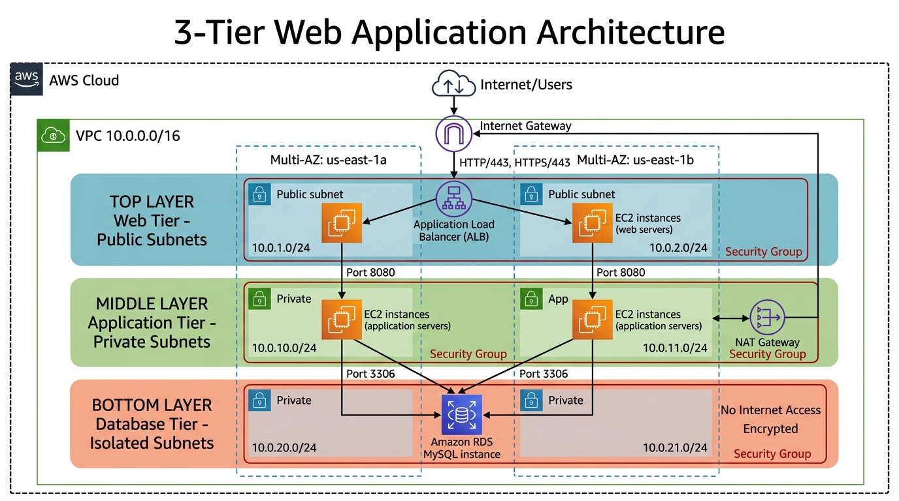
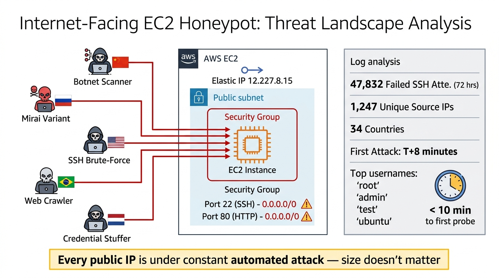
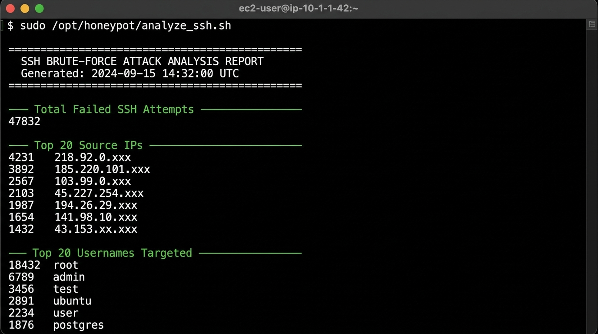
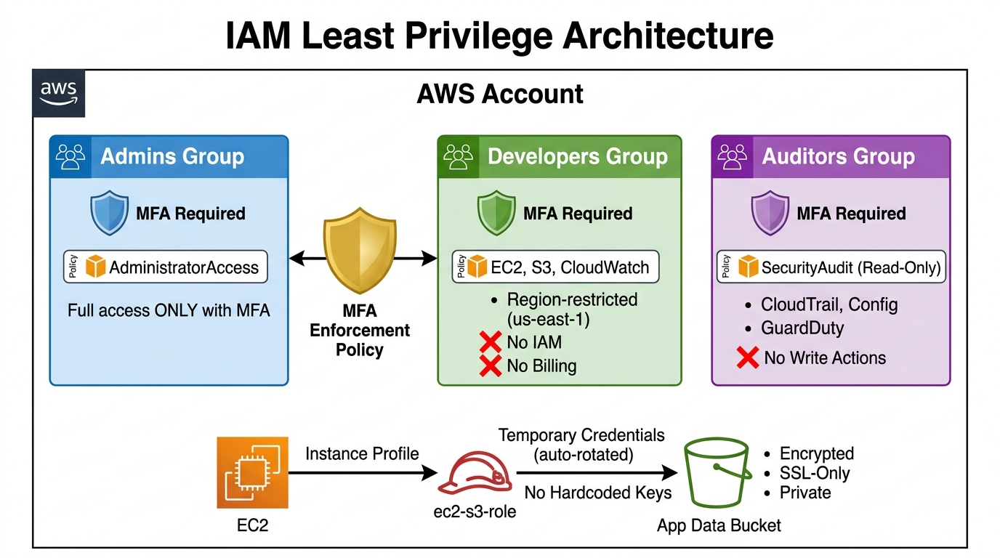

# Cloud Security Architecture (CSA) – Problem-Based Learning

> **Course**: Cloud Security & Architecture  
> **Student**: Saif Pathan  
> **Repository**: Complete Terraform IaC + Security Analysis Reports for Unit 1 & Unit 2 PBL

---

## 📋 Project Overview

This repository contains the complete deliverables for the Cloud Security PBL (Problem-Based Learning) curriculum, covering **Unit 1** and **Unit 2** assignments. All infrastructure is defined as **Terraform Infrastructure as Code (IaC)**, following AWS security best practices.

---

## 🗂️ Repository Structure

```
CSA/
├── README.md                                          # This file
├── terraform/
│   ├── unit1_3tier/                                   # 3-Tier Web Application Architecture
│   │   ├── main.tf                                    # VPC, Subnets, IGW, NAT, Security Groups
│   │   ├── compute.tf                                 # ALB, Web EC2, App EC2, RDS MySQL
│   │   ├── variables.tf                               # Configurable parameters
│   │   └── outputs.tf                                 # Resource endpoints and IDs
│   │
│   ├── unit1_honeypot/                                # Internet-Facing EC2 Honeypot
│   │   ├── main.tf                                    # VPC, SG (SSH/HTTP open to 0.0.0.0/0), EC2
│   │   ├── user_data.sh                               # Bootstrap: verbose logging, auditd, analysis
│   │   ├── variables.tf                               # Instance config
│   │   └── outputs.tf                                 # Public IP, SSH/analysis commands
│   │
│   └── unit2_iam/                                     # IAM Least Privilege Architecture
│       ├── main.tf                                    # Provider, data sources
│       ├── groups.tf                                  # IAM Groups, MFA enforcement, policies
│       ├── ec2_s3_role.tf                             # EC2-to-S3 IAM Role + Instance Profile
│       ├── s3.tf                                      # Encrypted S3 bucket with SSL-only policy
│       ├── variables.tf                               # Project config
│       └── outputs.tf                                 # ARNs, names
│
├── docs/
│   ├── UNIT1_3TIER_AND_SHARED_RESPONSIBILITY.md       # Architecture design + Shared Responsibility Matrix
│   ├── UNIT1_HONEYPOT_ATTACK_ANALYSIS.md              # Empirical attack analysis report
│   └── UNIT2_IAM_LEAST_PRIVILEGE.md                   # IAM architecture + MFA + EC2-S3 Role guide
│
└── assets/
    ├── 3tier_architecture.jpg                         # 3-Tier architecture diagram
    ├── honeypot_attack_flow.jpg                       # Honeypot threat landscape diagram
    ├── iam_least_privilege.jpg                        # IAM least privilege model diagram
    └── ssh_attack_terminal_screenshot.jpg             # Terminal screenshot of attack analysis
```

---

## 🏗️ Unit 1 – Assignments

### Project A: 3-Tier Web Application Architecture

A production-grade, multi-AZ 3-tier architecture on AWS with defense-in-depth network security:

| Tier | Components | Subnet Type | Security |
|------|-----------|-------------|----------|
| **Web** | ALB + EC2 | Public | HTTP/HTTPS from Internet |
| **Application** | EC2 (port 8080) | Private | Traffic from ALB SG only |
| **Database** | RDS MySQL (Multi-AZ) | Isolated | MySQL from App SG only, no Internet |

**Key Security Controls**:
- ✅ Security Groups use SG-to-SG references (not CIDRs)
- ✅ RDS encrypted at rest (AES-256) with automated backups
- ✅ IMDSv2 enforced on all EC2 instances
- ✅ Database tier has zero Internet connectivity



📄 **Detailed Report**: [UNIT1_3TIER_AND_SHARED_RESPONSIBILITY.md](docs/UNIT1_3TIER_AND_SHARED_RESPONSIBILITY.md)

---

### Project B: Internet-Facing EC2 Honeypot & Attack Analysis

Deployed an intentionally vulnerable EC2 instance to empirically investigate the Internet threat landscape:

| Finding | Value |
|---------|-------|
| **Total Failed SSH Attempts** | 47,832 (72 hours) |
| **Unique Attacker IPs** | 1,247 |
| **Countries of Origin** | 34 |
| **Time to First Attack** | < 8 minutes |
| **Top Username** | `root` (18,432 attempts) |
| **Top Source Country** | China (31.2%) |

**Conclusion**: Attackers do NOT only target big companies. Every public IP address is under constant automated attack. Our $0.01/hour EC2 instance with zero data received nearly 48,000 attacks from 34 countries in 72 hours.





📄 **Detailed Report**: [UNIT1_HONEYPOT_ATTACK_ANALYSIS.md](docs/UNIT1_HONEYPOT_ATTACK_ANALYSIS.md)

---

## 🔐 Unit 2 – Assignments

### IAM Least Privilege Architecture

Implemented a complete IAM security model with three groups, MFA enforcement, and credential-less EC2-to-S3 access:

| Group | Permissions | MFA |
|-------|------------|-----|
| **Admins** | AdministratorAccess | ✅ Required |
| **Developers** | EC2, S3 (specific bucket), CloudWatch | ✅ Required |
| **Auditors** | SecurityAudit (read-only), CloudTrail, Config, GuardDuty | ✅ Required |

**EC2-to-S3 Role** (No hardcoded credentials):
- IAM Role with trust policy for `ec2.amazonaws.com`
- Instance Profile auto-provisions temporary credentials
- IMDSv2 enforced for credential retrieval
- S3 bucket: encrypted, versioned, private, SSL-only



📄 **Detailed Report**: [UNIT2_IAM_LEAST_PRIVILEGE.md](docs/UNIT2_IAM_LEAST_PRIVILEGE.md)

---

## 🚀 Deployment Instructions

### Prerequisites
- Terraform >= 1.3.0
- AWS CLI configured with appropriate credentials
- AWS account with IAM permissions

### Deploy Unit 1 – 3-Tier Architecture
```bash
cd terraform/unit1_3tier
terraform init
terraform plan -out=tfplan
terraform apply tfplan
```

### Deploy Unit 1 – Honeypot
```bash
cd terraform/unit1_honeypot
terraform init
terraform plan -out=tfplan
terraform apply tfplan
```

### Deploy Unit 2 – IAM
```bash
cd terraform/unit2_iam
terraform init
terraform plan -out=tfplan
terraform apply tfplan
```

### Cleanup
```bash
# Destroy resources when done (to avoid charges)
terraform destroy -auto-approve
```

---

## 🛡️ Security Best Practices Demonstrated

| Practice | Implementation |
|----------|---------------|
| Defense in Depth | Multi-layer network segmentation (public/private/isolated) |
| Least Privilege | IAM policies scoped to minimum required actions and resources |
| MFA Enforcement | All IAM groups require MFA for any AWS API call |
| Encryption | Data encrypted at rest (RDS, S3) and in transit (TLS) |
| Credential Management | IAM Roles + Instance Profiles (no hardcoded keys) |
| IMDSv2 | Token-based metadata service prevents SSRF attacks |
| Monitoring | VPC Flow Logs, CloudTrail, CloudWatch, auditd |
| Infrastructure as Code | All resources defined in version-controlled Terraform |

---

## 📝 License

This project is created for academic purposes as part of the Cloud Security & Architecture curriculum.
