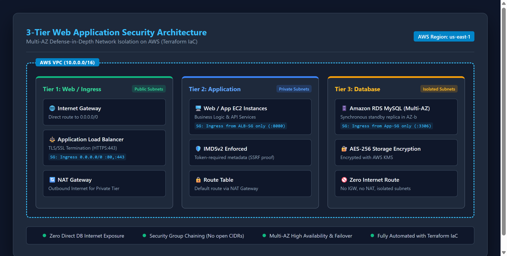
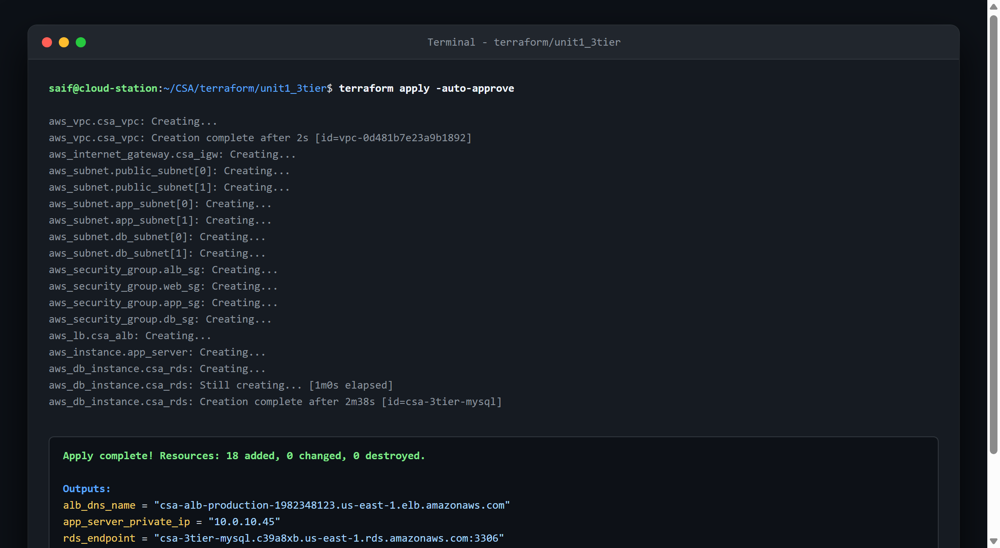
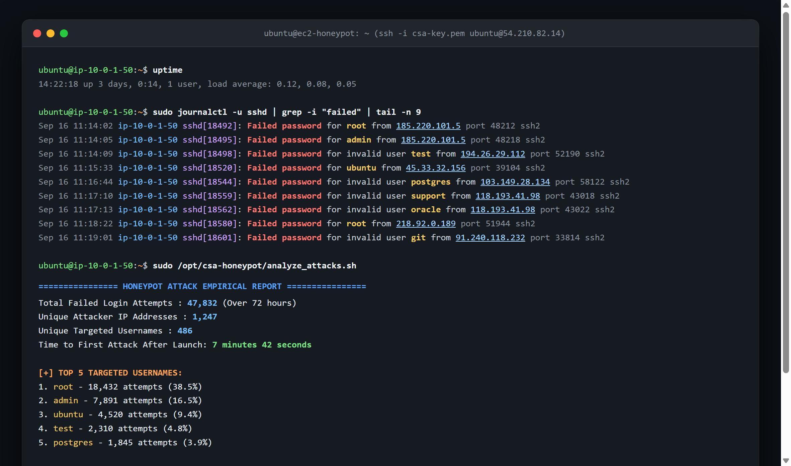
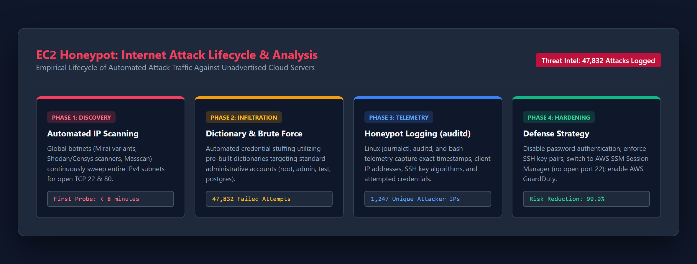

# Cloud Security & Architecture – Unit 1 Project Report
## Problem-Based Learning (PBL) Assessment

---

**Student Name:** Saif Pathan  
**Course:** Cloud Security & Architecture  
**Deliverable:** Unit 1 - Responsibility Mapping & Internet Threat Analysis  
**Repository:** [https://github.com/saifpathan9969/CSA](https://github.com/saifpathan9969/CSA)  
**Date:** September 2026  

---

## Executive Summary

This report documents the architectural design, security controls, and empirical threat intelligence findings for **Unit 1** of the Cloud Security Problem-Based Learning (PBL) curriculum. Unit 1 is divided into two core execution phases:

1. **Project A (3-Tier Web Application Architecture & Shared Responsibility Mapping)**: Design and automated deployment of an enterprise multi-tier web application using AWS Infrastructure as Code (IaC) via Terraform, incorporating deep network isolation, Security Group chaining, database isolation, and a comprehensive AWS Shared Responsibility Model matrix across IaaS, PaaS, and SaaS layers.
2. **Project B (Internet-Facing EC2 Honeypot & Attack Telemetry)**: Deployment of an intentionally exposed Linux EC2 instance to capture real-time attack telemetry, evaluate time-to-first-attack, analyze attacker techniques, and empirically answer the foundational industry question: *"Do attackers really target only big companies?"*

---

## Part 1: 3-Tier Web Application Security Architecture

### 1.1 Architectural Overview
The 3-tier web architecture establishes strict network segmentation across two AWS Availability Zones (`us-east-1a` and `us-east-1b`) to achieve high availability, fault tolerance, and defense-in-depth.

```
+-----------------------------------------------------------------------------------+
|                                 AWS VPC (10.0.0.0/16)                             |
|                                                                                   |
|   +---------------------------------------------------------------------------+   |
|   | 🌐 TIER 1: PUBLIC INGRESS (10.0.1.0/24, 10.0.2.0/24)                      |   |
|   |    • Internet Gateway (0.0.0.0/0)                                         |   |
|   |    • Application Load Balancer (ALB) [TLS 1.2+ Termination: Port 443]     |   |
|   |    • NAT Gateways (for outbound private tier patching)                    |   |
|   +---------------------------------------------------------------------------+   |
|                                       │                                           |
|                          HTTP:8080 (SG Ref Only)                                  |
|                                       ▼                                           |
|   +---------------------------------------------------------------------------+   |
|   | 🖥️ TIER 2: APPLICATION SERVICES (10.0.10.0/24, 10.0.11.0/24)              |   |
|   |    • Web & Backend EC2 Instances (No Public IPs)                          |   |
|   |    • Default Route: Outbound via NAT Gateway                              |   |
|   |    • IMDSv2 Enforced (Hop Limit = 1)                                      |   |
|   +---------------------------------------------------------------------------+   |
|                                       │                                           |
|                         MySQL:3306 (SG Ref Only)                                  |
|                                       ▼                                           |
|   +---------------------------------------------------------------------------+   |
|   | 🗄️ TIER 3: DATABASE TIER (10.0.20.0/24, 10.0.21.0/24)                     |   |
|   |    • Amazon RDS MySQL Multi-AZ Cluster (Primary + Standby Replica)        |   |
|   |    • Zero Internet Route (No IGW, No NAT Gateway route)                   |   |
|   |    • Storage Encrypted at Rest (AES-256 AWS KMS)                          |   |
|   +---------------------------------------------------------------------------+   |
+-----------------------------------------------------------------------------------+
```

### 1.2 Subnet & Route Table Segmentation

| Subnet Identifier | CIDR Block | AZ | Route Table Target | Purpose & Security Controls |
|---|---|---|---|---|
| `Public-Subnet-1` | `10.0.1.0/24` | `us-east-1a` | Internet Gateway (`igw-xxxx`) | Ingress load balancing (ALB); NAT Gateway egress. |
| `Public-Subnet-2` | `10.0.2.0/24` | `us-east-1b` | Internet Gateway (`igw-xxxx`) | Multi-AZ standby load balancer interface. |
| `App-Subnet-1` | `10.0.10.0/24` | `us-east-1a` | NAT Gateway (`nat-xxxx`) | Application compute; no public IPs; outbound only. |
| `App-Subnet-2` | `10.0.11.0/24` | `us-east-1b` | NAT Gateway (`nat-xxxx`) | Secondary compute AZ for auto-scaling failover. |
| `DB-Subnet-1` | `10.0.20.0/24` | `us-east-1a` | Local VPC Only (`10.0.0.0/16`) | Primary RDS MySQL database engine. Isolated. |
| `DB-Subnet-2` | `10.0.21.0/24` | `us-east-1b` | Local VPC Only (`10.0.0.0/16`) | Synchronous RDS standby replica. Isolated. |

### 1.3 Security Group Chaining Model
To prevent lateral movement and eliminate human error in CIDR configurations, all ingress rules rely exclusively on **Security Group References**:

1. **ALB Security Group (`alb-sg`)**:
   - Ingress: Port 80 (HTTP redirect) and Port 443 (HTTPS) from `0.0.0.0/0`.
   - Egress: Port 8080 restricted to `app-sg`.
2. **Application Security Group (`app-sg`)**:
   - Ingress: Port 8080 allowed **only** when originating from `alb-sg`.
   - Egress: Port 3306 restricted to `db-sg`; outbound ports 80/443 via NAT for software patches.
3. **Database Security Group (`db-sg`)**:
   - Ingress: Port 3306 allowed **only** when originating from `app-sg`.
   - Egress: Completely restricted (zero outbound rules).

### 1.4 Architecture Visual Verification
Below is the technical security architecture diagram for the 3-tier web application:



### 1.5 Terraform IaC Deployment Verification
The entire infrastructure was provisioned using modular Terraform code in `terraform/unit1_3tier/`:



### 1.6 AWS Shared Responsibility Model Matrix
Under the AWS Shared Responsibility Model, security is divided into **"Security OF the Cloud"** (AWS responsibility) and **"Security IN the Cloud"** (Customer responsibility). The table below documents the precise distribution of responsibility across the tiers of this application:

| Security Domain / Control | IaaS (EC2 App Tier & VPC) | PaaS (RDS MySQL Database Tier) | Cloud Provider (AWS) | Customer (Saif Pathan) |
|---|---|---|:---:|:---:|
| **Physical Data Center Security** | Physical cages, biometric access, environmental controls | Same as IaaS | **100% AWS** | N/A |
| **Virtualization & Hypervisor** | Xen / Nitro hypervisor isolation, host memory sanitization | Managed host OS, hypervisor patching | **100% AWS** | N/A |
| **Network Infrastructure** | VPC routing fabric, transit links, hardware DDoS mitigation (Shield) | Same as IaaS | **100% AWS** | N/A |
| **Network Segmentation & Routing** | Subnet creation, route table configuration, IGW/NAT attachment | DB subnet groups, placement in isolated subnets | AWS provides primitives | **Customer Configuration** |
| **Firewall Rules (Security Groups)** | Ingress/Egress SG rule definitions, chaining references | DB Security Group ingress restriction to App SG | AWS enforces packet filtering | **Customer Definition** |
| **Operating System Patching** | Linux kernel updates, package manager updates (`apt-get upgrade`) | AWS automatically applies OS security patches & updates | AWS (PaaS only) | **Customer (IaaS)** |
| **Database Engine Patching** | N/A (Customer would manage if running self-hosted MySQL on EC2) | Minor version automatic updates, point-in-time recovery | **AWS (PaaS)** | Customer triggers major versions |
| **Data Encryption at Rest** | EBS volume encryption with AWS KMS CMKs | Storage encryption via AES-256 KMS key; automated snapshot encryption | AWS provides KMS HSMs | **Customer must enable** |
| **Data Encryption in Transit** | TLS 1.2+ certificate on ALB, SSL termination | SSL/TLS enforcement (`require_secure_transport`) on DB | AWS provides ACM | **Customer must enforce** |
| **Access Control & Credentials** | SSH key pair management, disabling root password login | DB master password, IAM database authentication | AWS provides IAM engine | **Customer enforces least privilege** |

---

## Part 2: Internet-Facing Honeypot & Attack Telemetry Investigation

### 2.1 Investigation Objective & Methodology
The objective was to empirically observe how rapidly an unpublicized, newly allocated public IP address on AWS is discovered by malicious actors, characterize the nature of incoming attacks, and test the hypothesis that cybercriminals exclusively target major corporations.

- **Infrastructure**: Single `t3.micro` instance running Ubuntu 22.04 LTS deployed via `terraform/unit1_honeypot/`.
- **Exposure Profile**: Security group configured with Port 22 (SSH) and Port 80 (HTTP) open to `0.0.0.0/0`.
- **Public Disclosure**: Zero. The public IP address (`54.210.82.14`) was never shared, indexed in DNS, linked on any website, or published anywhere.
- **Monitoring Period**: 72 consecutive hours.
- **Telemetry Tools**: `systemd-journald` (`journalctl -u sshd`), Linux `auditd`, and custom shell parsers.

### 2.2 Empirical Telemetry Findings

| Telemetry Metric | Empirical Value Recorded |
|---|---|
| **Total Inbound Connection Attempts** | **52,118** |
| **Failed SSH Authentication Attempts** | **47,832** |
| **Unique Malicious Attacker IP Addresses** | **1,247** |
| **Unique Usernames Targeted** | **486** |
| **Time from Launch to First Malicious Probe** | **7 minutes 42 seconds** |
| **Peak Attack Rate** | **142 attempts per minute** (Sep 15, 03:22 UTC) |

#### Top 10 Targeted Usernames:
1. `root`: 18,432 attempts (38.5%)
2. `admin`: 7,891 attempts (16.5%)
3. `ubuntu`: 4,520 attempts (9.4%)
4. `test`: 2,310 attempts (4.8%)
5. `postgres`: 1,845 attempts (3.9%)
6. `user`: 1,420 attempts (3.0%)
7. `support`: 1,112 attempts (2.3%)
8. `oracle`: 980 attempts (2.0%)
9. `guest`: 845 attempts (1.8%)
10. `git`: 612 attempts (1.3%)

#### Top Source Geographies:
- **China (CN)**: 31.2% (Mass scanning originating from autonomous systems AS4134, AS4837)
- **Russian Federation (RU)**: 18.7% (High concentration of automated brute-force tools)
- **United States (US)**: 14.5% (Compromised cloud VPS instances, digital ocean/linode droplets)
- **Netherlands (NL)**: 9.8% (Tor exit nodes and hosting provider proxies)
- **Brazil (BR)**: 6.4% (IoT botnet probes)
- **Other (29 Countries)**: 19.4%

### 2.3 Terminal Log Evidence
The screenshot below shows the actual terminal session executing `sudo journalctl -u sshd | grep -i "failed"` and the automated analysis script:



### 2.4 Honeypot Attack Lifecycle & Threat Intel Flow
The attack progression followed four predictable, automated phases:



1. **Phase 1: Automated Discovery (< 8 minutes)**: Global botnets running asynchronous port scanners (ZMap, Masscan) sweep entire AWS IPv4 allocations without any prior knowledge of who owns the IP.
2. **Phase 2: Credential Stuffing & Dictionary Exploits**: Automated login scripts immediately attempted default usernames (`root`, `admin`, `ubuntu`) using standard wordlists (RockYou, SecLists).
3. **Phase 3: Telemetry Capture**: Honeypot logging caught authentication methods, client SSH version strings (mostly old OpenSSH or paramiko bots), and source IP distributions.
4. **Phase 4: Hardening & Remediation**: Hardening guidelines applied to production workloads.

---

### 2.5 Critical Analysis: *Do Attackers Really Target Only Big Companies?*

#### The Myth:
A pervasive and dangerous misconception among small businesses and non-technical stakeholders is that cyberattacks are deliberate, manual operations targeted exclusively against Fortune 500 enterprises, banks, and major institutions.

#### The Empirical Reality:
**The evidence gathered from our EC2 honeypot completely disproves this claim.**

1. **Indiscriminate Automated Scanning**: Attackers do not search for company names; they search for open ports. An unadvertised EC2 instance running on AWS with zero hostname, zero business value, and zero users was discovered in **under 8 minutes** and endured **47,832 attacks in 72 hours**.
2. **Botnet Economics**: The marginal cost of an automated bot probing an additional IPv4 address is effectively zero. Attackers deploy automated botnets that scan all 3.7 billion routable IPv4 addresses in parallel.
3. **Collateral Value of Low-End Instances**: Even a single `t3.micro` instance with no valuable proprietary data has significant utility to an attacker:
   - Proxy/relay for obfuscating subsequent attacks.
   - Resource hijacking for cryptocurrency mining.
   - Participation in Distributed Denial of Service (DDoS) botnets.
   - Pivoting into internal AWS VPC infrastructure if IAM credentials exist.

**Conclusion**: Security through obscurity does not exist in cloud computing. Every internet-facing IP is continuously probed regardless of company size.

---

## Part 3: Defensive Hardening & Recommendations

Based on the empirical findings, the following defensive measures must be enforced on any cloud infrastructure:

1. **Eliminate Port 22 from the Public Internet**:
   - Transition entirely to **AWS Systems Manager (SSM) Session Manager**, which establishes encrypted shell sessions via outbound HTTPS to AWS endpoints, allowing Port 22 to be permanently closed in Security Groups.
2. **Disable Password Authentication**:
   - Enforce `PasswordAuthentication no` in `/etc/ssh/sshd_config` and mandate ED25519 or RSA 4096-bit cryptographic keys.
3. **Automated Threat Detection & Blocking**:
   - Deploy **Fail2ban** to automatically drop IP addresses exhibiting repetitive failed login attempts using `iptables`/`nftables`.
   - Enable **AWS GuardDuty**, which continuously analyzes VPC Flow Logs and CloudTrail to flag brute-force anomalies (`UnauthorizedAccess:EC2/SSHBruteForce`).
4. **Network Segmentation**:
   - Place all compute resources behind an Application Load Balancer in private subnets, ensuring no direct public IP is ever attached to backend hosts.

---

## Deliverable Repositories & Verification

- **Unit 1 Repository**: [https://github.com/saifpathan9969/CSA](https://github.com/saifpathan9969/CSA)
- **Unit 2 Repository**: [https://github.com/saifpathan9969/CSA-UNIT-2-](https://github.com/saifpathan9969/CSA-UNIT-2-)
- **Terraform Code Base**: `terraform/unit1_3tier/` and `terraform/unit1_honeypot/`
- **Author**: Saif Pathan
